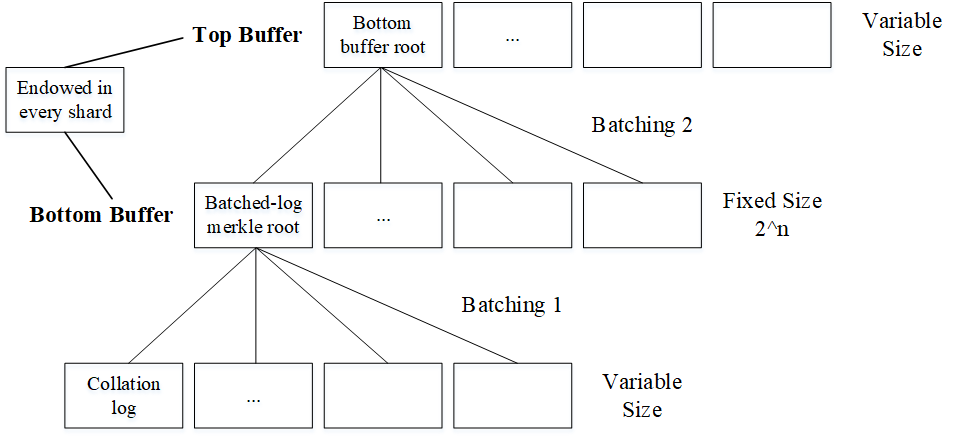

# Double-batched默克尔日志累加器

这是用在轻客户端（SPV），乃至于未来可能的以太坊无状态客户端（全节点）上的一种方案。于2018年1月在ethereum research论坛上提出，并在后续写入了无状态以太坊spec的wiki中。

## 应用

轻节点（SPV）如何确认某个区块是否在主链上？比如最新的区块。

最直接的方法是同步所有区块头，通过完整的区块头链确定。然而目前以太坊的区块头已经超过1100万，至少需要6GB的空间。这对轻节点客户端很不友好，需要花费额外的时间去同步完所有的区块头（而且还要能稳定接的上有数据的节点以确保全部区块头都能同步完成）。

不过通过“双倍批量默克尔日志累加器”（Double-batched merkle log accumulator）就可以较好的解决这一问题。只需要很小的存储开销（小于1M）来保存双层的日志累加器，就可以通过累加器生成简单默克尔证明来证明历史区块头包含在正统链上（此时客户端只需准确掌握信标链上最新区块头的信息）。

由于在无状态以太坊中，全节点需要频繁切换其所在的分片，在其手中没有该分片的历史数据以及state的merkle树的情况下，其可以等同为一个轻节点入链（分片）。而在这种情况下要做验证以及出块工作，就需要确定之前的区块是否是有效的（即保证其在最长链而非伪链或叔块上继续出块），因此可以简单的等同到前面讨论的情况。

## 源码

先上源码和原话：

> It really is super simple. There’s a fixed-size bottom buffer, and an uncapped top buffer, both storing Merkle roots. **Phase 1 batching Merklelises logs and saves the root to the bottom buffer. When the bottom buffer is full it is Merklelised and the root is saved to the top buffer.** Below is incomplete and untested Go code.

``` golang
package accumulator

type Hash [32]byte
type Log []byte

const bottomBufferSize = 1 << 10

// The bottomBuffer and topBuffer combined make up the accumulator
var bottomBuffer []Hash
var bottomBufferIndex uint
var topBuffer []Hash

func AccumulateLogs(logs []Log) {
	// Phase 1 batching: Merklelise logs and save root in bottom buffer
	var hashes []Hash
	for i := 0; i < len(logs); i += 1 {
		hashes = append(hashes, hashLog(logs[i]))
	}
	bottomBuffer[bottomBufferIndex] = getMerkleRoot(hashes)

	// Phase 2 batching: When the bottom buffer is full, Merklelise it and save root in top buffer
	bottomBufferIndex += 1
	if bottomBufferIndex % bottomBufferSize == 0 {
		bottomBufferIndex = 0
		topBuffer = append(topBuffer, getMerkleRoot(bottomBuffer))
	}
}

func hashLog(log Log) Hash{
	var hash Hash
	// TODO: Implement a hash function (e.g. SHA256, or Keccak)
	return hash
}

func getMerkleRoot(hashes []Hash) Hash{
	var root Hash
	// TODO: Merklelise hashes and return Merkle root
	return root
}
```

## 原理

将源码和描述的double-Batched累加器的结构绘制成图：



结构很简单也很清晰，主要用于提升MMRs（Merkle Mountain Ranges）和3MRs（multi-MMRs）的效率。底层buffer是固定大小的，跟树的高度有关（这里为n），因此能容纳*2^n*个条目，而顶层buffer的大小不固定，随着排序（collation）高度线性增长，但增长速度很慢。

在collation过程中产生的log会被批处理成merkle tree，其root会作为底层buffer的一个条目。当底层的条目“满了”，即最后一个条目被更新为最新的批处理日志根时，底层buffer又会作为一棵merkle tree将其root添加到顶层buffer中。

值得注意，提升效率很重要的一点就是witnesses（见证数据）只会更新一次，具体是在底层buffer到达最后一个条目的时候，会将其根batch into顶层buffer，然后开启新一轮的底层buffer。原因是这个累加器是log-appended形式的，日志只支持增加而不支持修改，这意味着前序的witnesses不会更改，除非前序的log root发生了改变（即开始了新的一轮时）。这也是为什么这个累加器适用于历史数据而不是实时数据了（比如'push the state into history'）。

还提到了一下pre-witness和permanent witness的概念。

> We call the initial witness upon log creation (the log batch Merkle path) the “pre-witness”. We call the final witness created by concatenating the pre-witness with bottom buffer Merkle path ( n hashes) the “permanent witness”.

文中还提到了可以将permanent witness与私钥等一起存储。

## 简单分析

文中给了关于存储开销的简单分析：

累加器Size：*32 \* (2\^n + h / 2\^n)* 。其中 *32* 是hash的字节数（即每个条目的大小），*2\^n* 则是底层buffer的大小，*h* 是collation的高度。之所以 *h/2\^n* 是底层buffer填充完一轮后顶层buffer才会增加一个条目。

分析中令 *n=13* 即底层buffer的树高为13，collation的间隔为8秒。可以计算出底层buffer的大小为 *32 \* 2^13 = 262KB* ，顶层buffer增长至750KB所需要的时间为 *750KB / 32B \* 8s \* 2^13 / 86400s / 365days = 49years* 。因此文中认为累加器的大小可以考虑为小于1MB。

至于为什么用merkle树的形式而非RSA等算法来做累加器，其也有提到[原因](https://ethresear.ch/t/double-batched-merkle-log-accumulator/571/7)，这里就不再重述。

这个方案目前还未被用在状态数据方面，但可以作为区块头累加器，来证明某个区块头是来自主链。

## 参考

[Double-batched Merkle log accumulator](https://ethresear.ch/t/double-batched-merkle-log-accumulator/571)
[A cryptoeconomic accumulator for state-minimised contracts](https://ethresear.ch/t/a-cryptoeconomic-accumulator-for-state-minimised-contracts/385)
[The winding road to functional light clients - part 2](https://snakecharmers.ethereum.org/the-winding-road-to-functional-light-clients-part-2/)
[Stateless Ethereum Specs - glossary](https://github.com/ethereum/stateless-ethereum-specs/wiki/Glossary#Header-Accumulator)