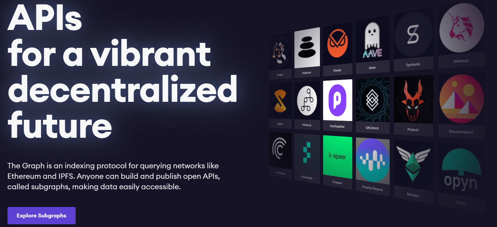
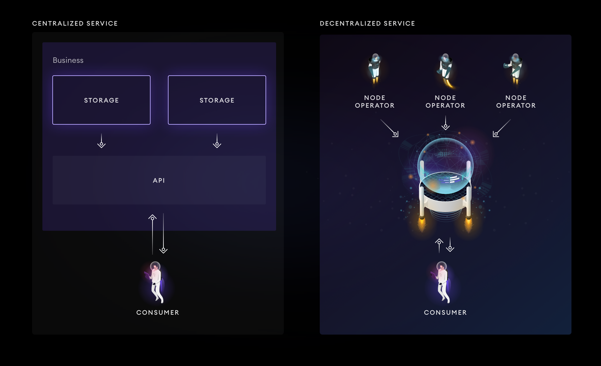
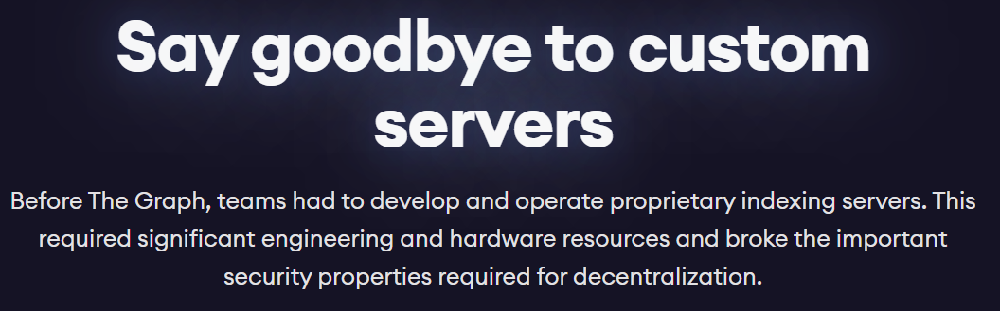
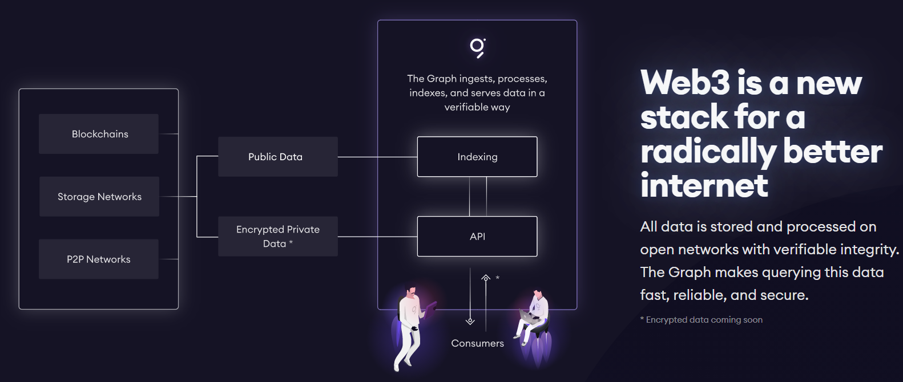
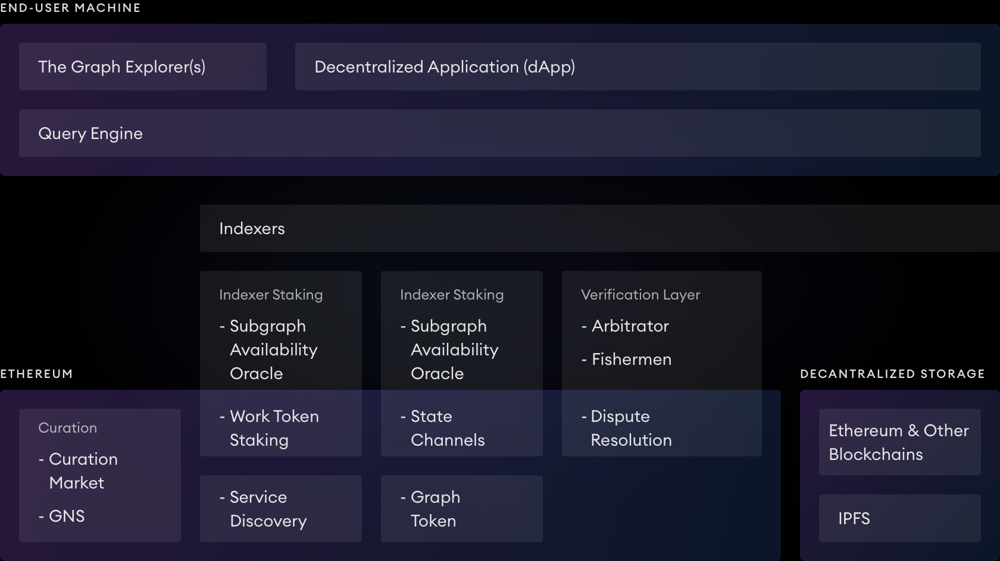
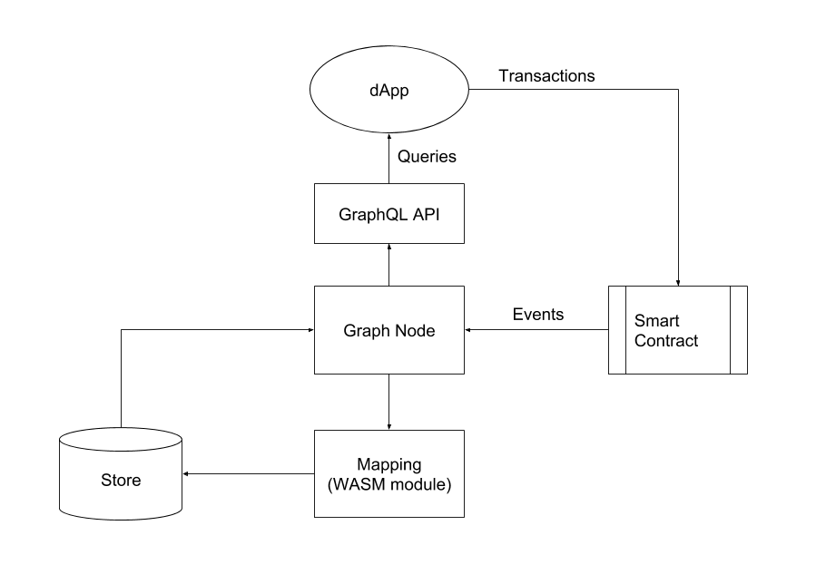
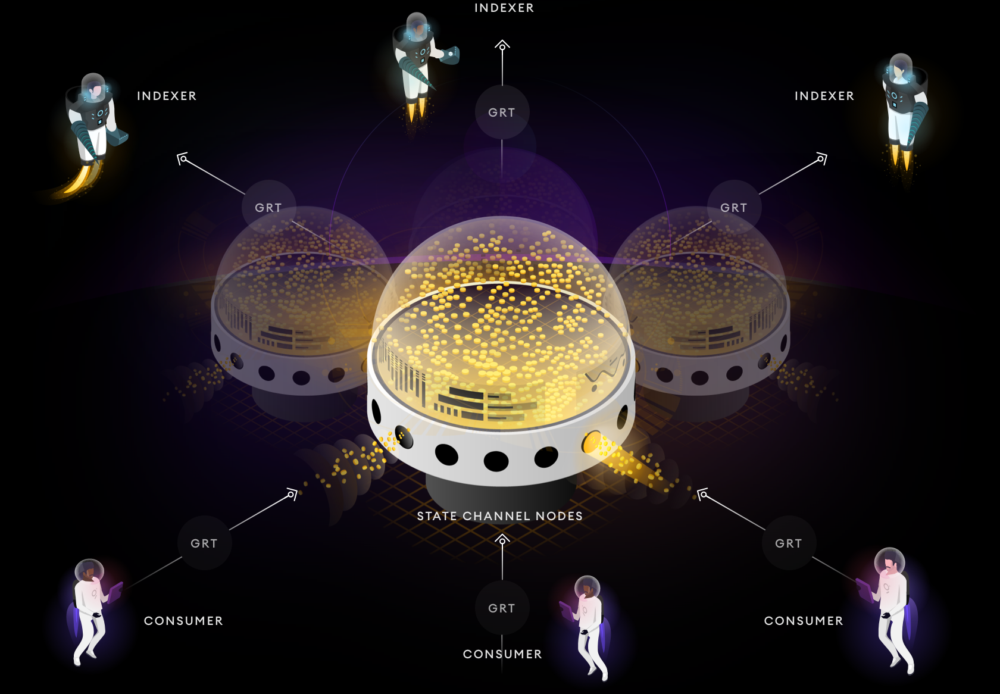

# The Graph索引器

想了想还是将The Graph项目的索引器放到以太坊这块来讲，因为目前The Graph还是基于以太坊主网部署的协议，还未独立成一个成熟的链以支持所有的区块链项目索引。而其原理目的和工作流程通过以太坊这一层面来阐述会更浅显、通俗易懂一些。

## 前言

在具体探讨索引器（indexer）之前还得对The Graph这个项目有个初步了解。

有些数据是具有价值的，尤其是在金融领域。而目前区块链中成熟的应用大都集中在金融领域，尤其是近些年来在以太坊上爆火的DeFi（Decentralized Finance），更是带动了一波区块链行业的发展，如Uniswap，Kyber，Balancer等。检索特定合约或事件乃至整个链的信息就好比在股市里了解某一只股票的情况、交易量/额度或是了解整个大盘的行情，是帮助消费者做决策的关键辅助。

关键点则是，与股市一样，能提供这些完整信息的只有特定的角色。在区块链中，这类角色叫全节点（Full Node），全节点会同步整个区块链，持有其完整的状态，能做状态转换与事件监听。但问题是，全节点的维护开销很大，以以太坊为例其全节点需要近700G的存储空间（且目前其仍保持线性增长的速度），且需要24小时在线与网络保持同步，执行计算也需要开销，一般用户和对链上其他信息不关心的快速开发的DApp是不会想要负担这些代价的。

想要检索信息，又不想维护全节点。因此在早期的发展中出现了Infura这类项目，其本身是全节点对外提供api接口以供信息的检索（全节点的服务），且是免费无偿的（据说是有以太坊的补贴）。Infura作为以太坊最大的节点提供商，其为很多常用的Web3.0应用以及中心化交易所（如币安）提供工具和基础设施，换言之，很多应用、服务和节点（包括用户节点）都依赖于Infura。

但这又引入了一个问题，即Infura导致了区块链的中心化。这一切的前提就是信任Infura这一个中心化的节点，也造成了Infura对区块链的影响变大。Infura一旦宕机（2020年11月的事件，是一个休眠漏洞引起的，版本不同的geth会引发分叉），依赖于Infura的服务将脱离区块链主链，无法与区块链进行正常的交互，换言之其被孤立到一个少数人的孤块链，而以太坊也发生了一次“硬分叉”。

这也推动了业界对去中心化数据检索的重视，尤其是去中心化的交易所如uniswap等，其想要保持其项目的火热必然脱离不开数据检索，但又不想依赖于单一的全节点导致其“去中心化”的特性虚有其表。The graph则是为解决这一问题而诞生的项目，尽管目前还不知道其发展如何，但不管怎样，其还是提供了解决这类问题的一个思路。

下图前者是Infura形式的中心化检索，后者是The Graph形式的去中心化检索。

此外也让很多需要自己维护全节点的项目，或者说独立维护正确索引服务器的团队可以从这项工作中脱离出来，专注于项目上，且安全性更能得到保障。用户检索数据只需要向提供数据检索服务的节点支付小费即可。

事实上，The graph的概念并不复杂，关键点无非就是以下几点：

* 提供数据检索服务。这便是The Graph的Indexer（索引器），其本质原理与运行一个Infura节点并无不同，同样需要同步区块链、监听事件并对外提供API接口。
* 保证数据的正确性。由于任何人都可以成为Indexer提供数据检索服务，为了防止恶意节点不存储真实数据而提供错误的数据给用户，需要有相应的监管来杜绝这类行为。这就是The Graph里的fishman（钓鱼人）。
* 提供数据检索的需求。由于在The Graph中，每一个子图（subgraph）对应一个项目（合约、或未来的各类链），维护子图需要维护特定的数据库以及检索用的API，因此并不是所有的项目都能提供检索服务。需要有角色指出在这之上构建子图能带来的收益，为Indexer指引方向。这就是The Graph里面的Curator，其一般是能对区块链市场与发展做出分析的节点，或者项目开发者为了扩大影响力要求提供检索服务的节点所担当的。

这样就实现了一个去中心化的数据检索服务，本质上The Graph也是一个去中心化的系统，或者说区块链，每个角色都是这一“去中心化”不可或缺的一部分。

用户则无需关心后续系统内部的结构运行，一旦数据的索引工作进入正轨，便有一系列的措施保证数据存储与执行的正确性，用户也只需要调用其对外提供的API接口便可以交互的方式获取自己想要的数据。

## Indexer的原理

官方给出的原理图已经能够比较清晰的描述出Indexer的原理：

从下往上来看，最下层是基于以太坊的基础设施，包括token的转账，构建consumer以及indexer之间交易的状态通道。右边是去中心化的存储，包括以太坊和IPFS等。构建在其上的就是indexer，包括构建子图引擎，而fisherman和arbitrator则负责验证和仲裁子图返回结果的正确性，保证数据可靠。再在其上的则是用户的终端，如graph的浏览器，别的开发者开发的dapp，其都是基于GraphSQL的查询引擎的，通过检索底层的数据，构建顶层的应用。浏览器可以对外提供底层的部分数据信息，而dapp可以检索自己所需的关键数据。

简单的工作流描述在下图中也就给出，与后续介绍的Indexer的工作流程差不多。

## Indexer的工作流程

部署Indexer的流程（大致的理解）：

1. 首先需要维护一个链的全节点才能保证状态转换的正确性以及监听合约的事件。目前The Graph支持的是Ethereum和IPFS，前者是区块链，后者是分布式文件系统，当然其本质都是分布式系统，可以都当成区块链来处理。有了全节点，理论上就可以提供这个链上所有已存在的数据。
1. 只有数据还不足以成为索引服务器。需要为“重要”的数据构建其索引数据库，并用合适的方式表现出来。因此在The Graph中就是构建一个Indexer索引服务器。例如监听某一个合约的所有事件，以及统计其用户数量，相关的交易以及交易的额度等。由于整个区块链中，简单的转账交易、合约的创建与调用都是共存的，且区块链中智能合约众多，通常需要找到需要关注的合约相关调用（如Uniswap的合约调用交易），而这个过程通常是通过Web3来与全节点的客户端交互完成的。
1. 需要对外提供相应的API接口，这个接口通常也是使用的Web3协议。通过这个接口就可以与索引数据库交互，而不是全节点客户端。
1. Indexer本身可以解析GraphQL这一The Graph自定义的数据库查询API。外部用户调用时并不是用的Web3，而是用数据库查询语言来完成，一是查询简单，只需要在部分字段填词；二是查询自由，可以通过组合或者转化的方式将子图信息以特定的条件检索出来成为全局图（global graph）。
1. Indexer接入The Graph的网络。

当然，构建子图的过程可能还有curator的指引，在之前就已经提到过，这里就没有再具体说明。

另附上用户（consumer）与Indexer交互的流程图：

简单来说，就是在一个大的子图集群里（即多个Indexer里）挑选其中一个（价格、响应速度、数据等符合自身需求），用GraphQL查询语句将数据从该子图中检索出来，在Indexer处具体表现为调用相应的API接口将数据调出，最后将数据返回给用户。查询请求通过状态通道（State Channel）交易The Graph的代币（GRT）来完成，由于这类交互过程往往比较频繁，因此状态通道确实是个不错的选择。

## 参考

1. https://thegraph.com/docs/introduction#what-the-graph-is
1. https://network.thegraph.com/
1. https://thegraph.com/blog/the-graph-network-in-depth-part-1
1. https://thegraph.com/blog/the-graph-network-in-depth-part-2
1. https://github.com/graphprotocol/graph-node/blob/master/docs/getting-started.md （内含subgraph的实例）
