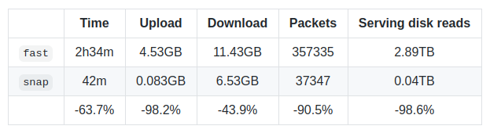

# 状态快照加速

最近以太坊的Geth即将发布Geth v1.10.0，迎来新的大版本，涉及到许多新特性，也为将要到来的柏林硬分叉打好基础。其中最引人注目的新特性是状态快照加速，这个技术提出已经有一段时间了，最近终于将它整合进了Geth，因此在这里整理了一下状态快照加速的一些资料，包括其基本原理，功能特性与效果。关于Geth v1.10.0的其他新特性可以参考文末给出的[参考链接1](#参考资料)。

## TLDR

状态快照加速是用额外的扁平结构键值对来减少读取的代价，降低硬盘访问的次数。应用状态快照加速可以：1）提升状态访问类型的DoS攻击的难度。2）提升状态查询的性能。3）降低同步的开销。

然而状态快照也会引入额外的存储开销与更新开销，而构造快照的开销也需要节点执行承担，最关键的是快照的写入是不可逆的操作，因此需要和状态剪枝一样，持久化128个块的快照，防止分叉导致需要重新构建快照，以及提供最近历史状态的读取。

## 背景与动机

在深入了解加速结构（acceleration structure）之前，我们先回顾一下以太坊的 「状态」 概念、状态在涉及到不同层次的抽象时又是如何存储的。

以太坊有两种不同类型的状态：账户的集合；每一合约账户存储槽的集合。从**完全抽象的角度**来看，两种数据都是 键-值 对。账户集合把地址映射到该地址的 nonce、余额，等等。而一个合约的存储领域把任意的值（由该合约定义并使用）映射到某个值。

但糟糕的是，虽然把这些键值对存储成扁平数据（flat data）可以非常高效，但验证它们的正确性在计算上就会变得很难。每当对数据修改时都要自下而上对所有数据做哈希运算。

为免去总是对整个数据库做哈希运算的需要，可以把数据库分割成连续的小片，然后建立出一种树状结构！最原始、最有用的数据就放在叶子节点上，然后树上每一个内部节点都是该节点以下内容的哈希值。如此一来，当要修改某些值时，就只需做对数次的哈希运算。这种数据结构其实就是 「默克尔树」。

但还没完，这种办法在计算复杂性上还是有所欠缺。默克尔树结构虽然在修改现有数据时非常高效，但是，如果插入数据和删除数据会更改底层小数据块的边界，那就会让**所有**已经算好的哈希值全都变为无效。

与其盲目地对数据库分组，可以使用键本身来组织数据、基于共同前缀将数据都安排到树状格式中！这样插入和删除操作都不会影响到所有节点，只会影响到从树根到叶子路径上的（对数个）节点。这种数据结构就叫 「帕特里夏树」。

把上面两种办法合在一起 —— 帕特里夏树的树状分层和默克尔树的哈希算法 —— 就是所谓的 「默克尔-帕特里夏树」(Merkle Patricia Tree)，也是实践中用于代表以太坊状态的数据结构。无论是修改、插入、删除还是验证，都只有对数复杂度！*唯一的小小例外是，有些键会在插入前做哈希运算（存入树中），以平衡整棵树。*

但遗憾的是，虽然所需操作的速度都很快，但每一种选择都有所牺牲。*更新操作和验证操作的对数复杂性*意味着对**每一个单独的密钥**的读取和存储都是对数复杂的（logarithmic reads and logarithmic storage）。这是因为树状结构的每一个内部节点都要单独保存在硬盘上。

而在大约一年以前，账户状态就已填满了 7 层高的树。这就意味着，每一次树操作（例如读取余额、写入 nonce）都要触达至少 7～8 个内部节点，因此会做至少 7～8 次持久数据库访问（persistent database accesses）。LevelDB 组织数据时最多也是 7 层，所以还有一个额外的乘数。最终的结果是，**单次**状态访问预计会放大为 **25～50** 次随机的硬盘访问。如果再乘上一个区块中的所有交易的所有状态读取和写入，还会得到一个**惊人**的数字。

[当然，所有客户端实现都在尽力降低开销。Geth 使用更大的内存区域来缓存数节点；还使用了内存内的修剪机制、避免将几个块之后就会删除的数据写入硬盘。不过这需要另外一篇文章才能讲清楚。]

可怕之处还在于，这个数字就是运行一个以太坊节点、保证能全时验证所有状态的成本。

在提出解决问题的方法之前，先看看问题的起因在哪：

以太坊的运行依赖于对状态的密码学证明。只要节点还想保持对所有数据的验证能力，就绕不开硬盘读写放大问题。也就是说，节点 **可以并且也事实上** 相信已经验证过的数据。

不断重复验证每一个状态物是没有意义的，但如果每次从硬盘中拉取数据都要验证一次的话，就是在做这样没有意义的事。*默克尔帕特里夏树结构本质上是为写入操作设计的，但反过来就成了读取操作的负担*。虽然摆脱不了它，也无法让它瘦身，但这绝不意味着在每一个场合都必须使用它。

以太坊节点访问状态的场景可大致分为以下三类：

* 在导入一个新区块的时候，EVM 代码的执行会产生或多或少基本平衡的状态读取和写入次数。不过，一个用于拒绝服务式攻击的区块可能会产生远多于写入操作的读取操作次数。
* 当节点运营者检索状态的时候（例如调用`ethcall`及类似操作），EVM 代码执行仅产生读取操作（当然也可能有写入操作，但这些操作产生的数据最终会丢弃掉，不会持久化到硬盘里面）。
* 当节点在同步区块链的时候，同步者会向远程节点请求状态，被请求者会将数据挖掘出来并通过网络传播给同步者。

基于上述访问模式，如果可以短路（short circuit）读取操作而不触及状态树，则许多节点操作都可以变得快很多。这样甚至能开启一些新奇的访问模式（比如状态迭代），让原来因为太过昂贵而不可行的模式变为可能。

当然，还是不免有所牺牲。由于没有去掉树结构（验证仍要用到树结构来保证验证的高效性），任何新的加速结构都会带来额外的开销。问题只在于：额外的开销是否能带来足够多的好处，值得一试？

## 原理

其实在文章的开头就已经给出了答案：

> whilst storing these key-value pairs as flat data would be very efficient, verifying their correctness becomes computationally intractable.

既然理论上理想状态下以太坊状态的数据存储方式应是简单键值对，那直接用扁平结构就可以让读取操作绕过复杂的树结构，从而加速读取的过程。当然这个结构的目的也仅仅是为了加速读取，至于验证以及更新操作还是基于原来的默克尔帕特里夏树。

实际上就是把树的叶子节点全部取出单独作为一层扁平结构层。在不久之前，Geth就引入了**snapshot（快照）**加速结构（不是默认开启的）。一个快照就是给定一个区块处的以太坊状态的完整视图。抽象掉实现方面的细节，它就是把所有账户和合约存储槽堆放在一起，都由扁平的键值对来表示。

而每当想要访问某个账户或者某个存储槽的时候，只需付出一次 LevelDB 的查询操作即可，而不用在每棵树上查询 7～8 次。理论上来说，更新快照也很简单，处理完一个区块后，我们只需为每个要更新的存储槽多做 1 次额外的 LevelDB 写入操作即可。

换言之，当有新区块到来要改变状态时，在保持原有Merkle Patricia树的正常更新操作下，也对快照做简单的更新操作。而涉及到读取操作的时候，则跳过树的结构，直接使用快照做读取。下面给出各个操作的复杂度分析：

* 快照加速结构实际上将读取操作的复杂性从 O(log n) 降到了 O(1) （乘以 LevelDB 的开销，最多7层）。
* 代价是将写入操作的复杂性从 O(log n) 变成了 O(1 + log n) （乘以 LevelDB 的开销）。
* 并将硬盘存储空间从 O(n log n) 增加到了 O(n + n log n)。

## 运作

维持以太坊状态快照的可用性也不容易。只要区块还在一个接一个地产生，一个接一个地摞在最后一个区块上，那将最新变更合并到快照中的粗疏办法就能正常工作。但是，哪怕有微小的区块链重组（即便只有一个区块），快照机制就崩溃了，因为根本没有设计撤销操作（即一旦遇到分叉而进入了废弃链，那快照就需要重新构建了）。对扁平数据表示模式来说，持久化写入是单向的操作。而且让事情变得更糟糕的是，我们没办法访问更老的状态了（例如某些 DApp 需要 3 个区块以前的状态；或者 fast/snap 同步模式中要访问 64 个区块以前的状态）。

为了克服这些限制，Geth 客户端的快照由两部分组成：一部分持久化的硬盘层，是对旧区块（例如顶端区块前 128 个区块）处状态的完整快照；还有一棵内存内 diff 层组成的树，用于收集最新的写入操作（类似于git）。

处理新区块的时候，我们不会直接合并这些写入操作到硬盘层，而仅仅是创建一个新的、包含这些变更的内存内 diff 层。当内存内部的 diff 层积累到足够高的层数时，最底部的一个就开始合并更新并推到硬盘层。当需要读取一个状态物时，我们就从最顶端的 diff 层开始查找，一直往下，直至在 diff 层中或者在硬盘层中找到。

这种数据表示方法非常强大，解决了很多问题。因为内存内部的 diff 层组成了一棵树，所以 128 个区块以内的链重组只需取出属于父块的 diff 层，然后就此开始构建即可。需要较旧状态的 dApp 和远程同步者可以访问到最近 128 个最近的状态。开销变成了 128 次映射查找，但 128 次内存内的查找比起 8 次硬盘读取及 Level DB 的 4～5 倍放大要快上几个数量级。

当然，这里面还有很多很多的坑。就不讲太深了，简单列举就有下面这张清单：

* Self-destruct （合约自毁操作）（以及删除操作）特别难以对付，因为它们需要短路 diff 层的沉降（descent）。
* 如果出现了比持久硬盘层更深的链重组（指的是128块之前的），那现在的快照就要完全废弃掉、重新生成。整套操作非常昂贵。
* 在节点关机时，内存内的 diff 层需要持久化到日志并加载备份，不然重启之后快照就没用了。
* 使用最底层的 diff 层作为一个累加器，仅在其超过一定的内存使用时才刷新到硬盘。这就允许跨区块对同一存储槽执行去重写入操作（deduping write）。
* 要为硬盘层分配一个读取缓存，这样合约重复访问同一个古老的存储槽时硬盘才不会损坏。
* 在内存内 diff 层中使用累积的布隆过滤器（bloom filter），以便快速检测出状态物有没有可能存在于 diff 层中，还是应该直接跳到硬盘中查找。
* 不把原始数据（账户地址、合约存储键）设为键，而是以这些数据的哈希值为键，以保证快照的迭代顺序与默克尔帕特里夏树相同。
* 生成持久化硬盘层的时间要比剪除状态树窗口的时间多得多，所以即使是生成器，也需要动态地追踪链的运行。

## 优点与缺点

**优点**：

* **DoS**。在 2016 年，以太坊遭受了有史以来最严重的 DoS 攻击（“上海” 攻击），持续了大约 2 至 3 个月。这次攻击通过以太坊状态膨胀以及滥用各种gas 定价过低的操作码来导致以太坊网络瘫痪。经过无数次客户端优化和硬分叉再定价之后，这次危机才得以平息。但是问题的根源依然存在：状态访问操作码有着固定的 EVM gas消耗量 `O(1)`，但是执行成本 `O(logN)` 是缓慢增加的。我们已经通过 “橘子口哨”（Tangerine Whistle）、“伊斯坦布尔”（Istanbul）以及即将到来的 “柏林”（Berlin）分叉状态操作码的 gas 消耗量，让 EVM 成本（名义开销）与运行时成本更加一致，但这些都只是权宜之计。快照可以将状态读取的执行成本降低至 `O(1)`（使之与 EVM 成本更加一致），从而长期解决基于状态读取的 DoS 问题（请勿在他处引用这句话）。
* **调用**。检查以太坊上智能合约的状态需要一次微 EVM 执行。一方面是运行字节码，另一方面是从磁盘中读取状态插槽。如果你运行了一个只供自己使用的以太坊节点，当前的状态访问速度应该绰绰有余。如果你运行一个供多名用户使用的以太坊节点，快照所带来的 10 倍性能提升可以让你以同样的成本完成 10 倍数量的查询。
* **同步**。同步以太坊节点的方法主要有两种。你可以下载区块并执行区块中的所有交易。或者，你可以下载区块，验证其 PoW 证明，并下载与最新区块相关的状态。后者要快得多，但是需要通过其它节点获取最新状态的副本。在当前的 Merkle-Patricia 状态模型中，这些节点需要从磁盘上读取 **16TB** 的数据，才能满足节点同步需求。有了快照之后，这些节点只需从磁盘中读取 **96GB** 的数据，就能让新的节点加入网络。

**缺点**：

* 快照就是 Merkle Patricia trie 的叶节点中已经包含的原始以太坊状态的冗余副本。目前，快照在主网上额外需要大约 20 至 25 GB 的磁盘成本。好在，快照有望进一步实现状态存储优化，并降低当前 Merkle trie 的磁盘成本。
* 由于目前还没有人在网络中构建快照，节点最初需要自行承担迭代状态 trie 以及创建初始快照的开销。根据节点的负载，这可能需要耗时一天至一周，但是（一切顺利的话）每个节点在整个生命周期内只需完成一次。快照创建是在后台运行的，与其它节点操作同时执行。而以太坊的计划是，当全网节点都可获得快照时，就不再要求节点迭代状态 trie 并创建初始快照。

## 效果

Geth 的快照加速结构将状态读取的复杂性降低了一个数量级。这就意味着基于读取操作的 DoS 攻击的发动难度上了一个数量级，而 `ethcall` 调用也快了一个数量级（假设 CPU 不存在瓶颈的话）。

快照还让对最近的块进行快速状态迭代成为可能。*实际上这曾是以太坊开发快照机制的主要理由*，因为能以此为基础创造新的 `snap` [同步算法](https://github.com/ethereum/devp2p/pull/145)。在 Rinkeby 测试网上的基准测试很能说明问题：

当然，这一切同样不是没有代价的。当初始同步完成之后，参与主网的节点需要 9～10 小时来建构初始快照（此后再维持其可用性），还需要额外的 15 GB 以上的硬盘。

## 参考资料

* [Geth v1.10.0](https://blog.ethereum.org/2021/03/03/geth-v1-10-0/)
* [Ask about Geth: Snapshot acceleration](https://blog.ethereum.org/2020/07/17/ask-about-geth-snapshot-acceleration/)
