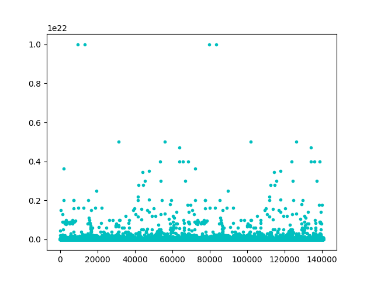
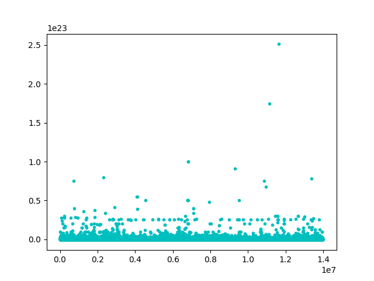

# 大数据下的Plot绘制

Python数据的可视化、图表的绘制，经常会用到matplotlib库，相关的介绍、源码和教学数不胜数，这里不再赘述。

用到该库的起因是Kimono君提取了一大批数据，现在需要对这些数据进行可视化处理，用图的形式将数据展示出来以方便后续的分析。由于Python有很成熟的绘制图表的库matplotlib，且其绘图脚本编写起来代码量少，效率高，因此kimono君便打算用python来给这批数据作图。

这批数据的量比较大，有大约1.5GB，目前分割成了10个文件。如果只是简单的绘图，python可以很轻易地完成这项工作，事实上也有很多相关的教学资源和笔记可以参考。但对于大数据下Plot的绘制，就需要思考内存的问题了，目前在网上也没怎么看到相关的介绍。

## 概况

- 输入： 测试用的190M数据文件，每行一个unsigned int，共约1400万行。
- 输出： 绘制数据的散点分布
- 环境： Python3.60，主要库为numpy和matplotlib.plt

## 过程与结果

首先将绘图代码的框架大致写一下：

```python
import matplotlib.pyplot as plt
import numpy as np

class Draw:
    def __init__(self, index = 1):
        pass

    def set_fn(self, fn):
        pass

    def read_data(self):
        pass

    def draw_scatter(self):
        pass

    def draw_bar(self):
        pass
        
if __name__ == '__main__':
    pass
```

这里为*Draw*类额外加了两个参数`index`和`fn`。`fn`是为了读取多个文件设置的文件名参数，`index`最初仅仅是作为数据的序号（横坐标）引入的一个参数。

将代码填入框架中，用两个删减后的数据文件进行简单的功能测试（每个大约1M，7万行）。这里`index`可以通过调用`update_index`进行横坐标起点的更新，以完成多个文件的连续绘图。

```python
class Draw:
    def __init__(self, index = 1):
        self.index = index
        self.plot = plt.subplot(111)
        self.length = 0
        self.data = []
        self.filename = ''

    def set_fn(self, fn):
        self.filename = fn

    def read_data(self):
        with open(self.filename, 'r') as f:
            self.length = 0
            self.data = []
            for content in f.readlines():
                self.data.append(content)
                self.length += 1
                    
    def update_index(self):
        self.index += self.length

    def draw_scatter(self):
        self.plot.scatter(np.arange(self.index, self.index + self.length),
                          self.data, c = 'c', marker = '.')

if __name__ == '__main__':
    prefix = 'datafile'
    d = Draw()
    for i in range(1, 3):
        d.set_fn(prefix + str(i))
        d.read_data()
        d.draw_scatter()
        d.update_index()
    plt.show()
```

绘图效果：



可以看出Plot绘制的基本功能已经有了，接下来可以尝试一下用分割后单个190M的数据文件（即[概况](#概况)中的输入）进行测试。

毫无任何意外的，内存爆掉了XD。

可以简单地分析一下，因为绘图的过程中数据都是会读入内存中的，因此会撑爆内存的地方一个是`read_data`，另一个则是`draw_scatter`。前者很好理解，因为用了`f.readlines()`，将数据一次性读入内存中，对于大文件而言内存负担会很大。但很明显这并不是主要的原因，文件仅有190M大小，但内存的使用量很快就超过了7G，导致爆存，原因只可能是在使用这批数据绘图的`draw_scatter`中了。在`plot.scatter`中一次性读取极大数据量的数据绘图会占用极大的内存空间，每个数据点以及相关的属性在未完成整体的绘制前都会消耗相应的内存资源，且在plot的过程中得不到释放（具体细节可以参考python库文件的`matplotlib/axes/_axes.py`)。

分析完后可以做个简单的修改。由于Python的子图可以进行多次Plot的绘制（当然这也是在一幅图中绘制多条曲线时经常用到的方式），于是对每次Plot绘制设置一个绘点的阈值上限，达到上限时再重新Plot一次，并用新的数据进行填充。

```python
class Draw:
    def __init__(self, index = 1):
        self.index = index
        self.plot = plt.subplot(111)
        self.length = 0
        self.data = []
        self.filename = ''
        self.datalimit = 100000

    def read_data_with_limit(self):
        with open(self.filename, 'r') as f:
            current = 0
            for line in f:
                if current == self.datalimit:
                    current = 0
                    self.draw_scatter()
                    self.update_index()
                    self.length = 0
                    self.data = []
                else:
                    self.data.append(line)
                    self.length += 1
                    current += 1
            if self.data:
                self.draw_scatter()
                self.update_index()
                self.length = 0
                self.data = []
```

这里顺便将读取文件数据的`readlines()`改为直接用内部管理buffer的`for line in fileHandler`方式，以解决读取大文件的问题。看一下绘图的效果如何：



看起来还不错，内存占用的开销到2G多就停下来了，能够正常work达成所需的目标（输出）。

虽然到这里就结束了，因为已经满足了kimono君的所需。但优化的空间肯定还有，而且10万个点的数量限制与对应的内存开销有什么关系，是否有更好的方式，这些还是值得去思考一番的。

[源码在这](./Code/AmountDraw.py)。

## 参考资料

1. [Python数据可视化—matplotlib笔记](https://blog.csdn.net/qq_34264472/article/details/53814635)
1. [python 大文件以行为单位读取方式比对](https://www.cnblogs.com/aicro/p/3371986.html)

## Time

2019-9-26 15:09:43