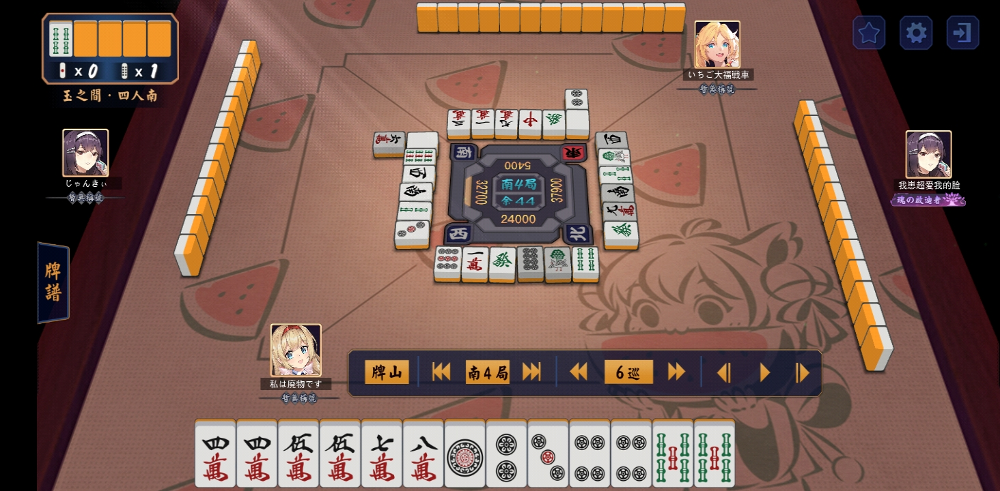
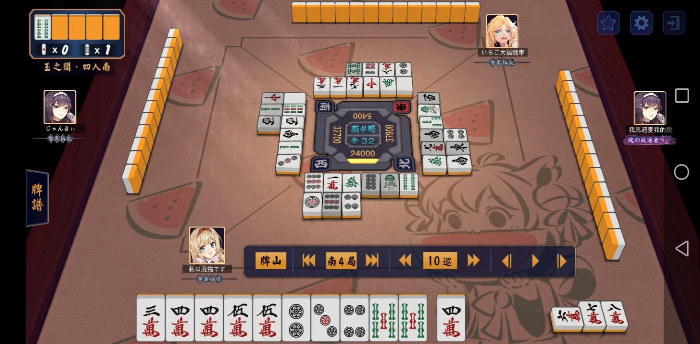
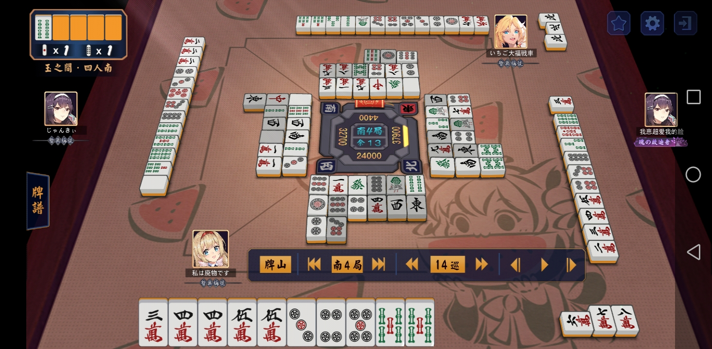
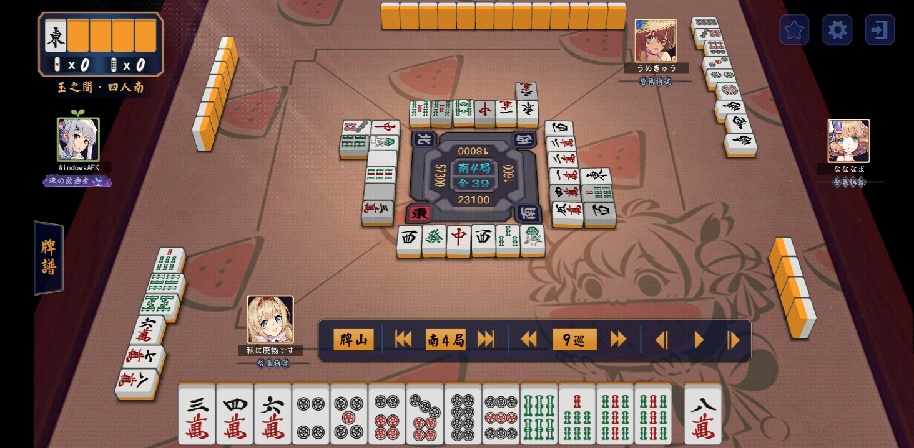

# 日本立直麻将-学习笔记

## 前言

这是一篇笔记来着。

日麻之所以有很强的竞技性质是因为其需要思考的地方有很多，这里大体可以分为这几个方面：1. **速度**，这是最重要的，做牌的速度决定的胡牌的几率，可以保庄、过庄和截胡别人的大牌，但也需要通过速度的判断来决定弃牌防守的时机。 2. **听牌**，有些牌即使能听牌，但注定是胡不了的，需要根据读牌、场况、胡牌的点数以及他家对日追立的可能性进行取舍，有时候即使听牌了也要选择弃胡防守或者兜形听。 3. **防守**，防守虽然是最坏的情况，但有效地防守可以让自己避免放铳，尤其是在多家听牌的情况下，防守需要思考的东西很多，因为安牌很可能是不够的，兜听只是走钢丝，在场况焦灼的时候才需要用命去抢罚符，一般情况下如何保证自己绝对的安全才是最重要的。 4. **场况**，最后才是场况的思考，并非不重要，但大多数情况用不上。简单的场况判断不难，也不需要费劲脑汁去思考，但如何在刚开局就有场况的思考，对三家特性的判断，电报过庄等，这才是真正烧脑的。

更具体的技术便是「进攻」、「防守」、「读牌」与「场况」，即以下几个篇幅的内容。

## 雀士匠人

多井（隆晴）pro			（防守型）		（防守可学）

> 「（3巡）这牌可以弃胡了」

土田（浩翔）pro			（7对子）		（防守进攻做牌可学）

> 「我最讨厌做7对子了，我还是更喜欢——摸着摸着就做七对子了」

小林刚					（副露进攻型）

> 副露速攻抢棒人——你们的立直棒都是我的！「这里他听牌/立直了，但我是不会弃胡防守的，即使我只有1000点。」

村上（淳）pro			（立直型）		（读牌很准，滴水不漏名侦探）

松本（吉弘）pro			（平衡型）		（立直方式、听牌时机、胡牌牌型可学）

胜又健志pro				（观察型）		（切牌时机，攻防转换与场况判断的能力）

金泰贤                  （综合型）      （场况判断和做牌判断很强）

## 防守篇

按多井pro的话说，日麻里胡率一般只有20%，4个人算上流局那些有的没的。三四巡如果牌型不好（比如说三四五向听，嵌张搭子多，进张面极少），再加上前几巡一张dora都没有（按照赤5麻将，一共7张dora，平均下来一个人有2张），且几巡都毫无进张，建议直接弃胡。此时还坚持对日或强胡的话，多半（80%）会出事。可以多留一些安牌，防止多家立直或铳大牌（满贯以上）。

然后，多思考。防守的重点就是读牌，读牌就需要思考别人的牌型。思考的方式很简单也很困难，简单在于其通用的思考模式，即逆向推理联动牌，如切2s时思考为何切2s，可能牌型是245s，244s固定雀头等；或切5m听牌，猜测胡2m筋的可能性，无非是13嵌2,22对碰，此时可以考虑场上2m的张数来排除22碰，根据4567等5周张的切牌情况判断其不会拆好型听嵌，或是no chance/薄壁等方式来确保2m的安全度。困难在于这些思考得在短时间内完成，读牌和逆推得非常熟练。

防守就是要多思考思考思考思考思考思考思考思考思考思考思考思考思考思考思考思考思考，这也是为什么多井pro的防守打牌，4个半庄下来他能瘦3kg胃穿孔（虽然他还记所有的手切摸切和 『切牌位置』，简直怪物）。

### 筋牌，壁与早巡外侧

这是新手入门时能学到的最简单的防守技巧。

筋牌最简单，找立直家的147/258/369的筋是很快的，毕竟牌河很整齐，这也是新手最容易学会的技巧。但筋牌存在被骗筋的问题，愚型和对碰是不吃筋牌的理论的。且筋牌安全度也有差别，19安全度最高，28次之，34567即使是两筋安全度也差很多。dora周边更是不能轻易信筋。更多数据和分析可以去看一下魔女或者79的blog，在文章结尾有。**这里可以给出一个防骗筋的简单小技巧**，就是立直牌的筋牌一定不要轻信。以5s为例，为了最大牌效，在立直前的牌很可能就是135s，然后立直理所当然选择5s（2s边张胡率高且可以骗筋）。

其次就是早巡外侧，这个也是根据听牌家的牌河判断的。*一般*早巡外侧的牌都是不要的，这个判断方式一般是自己没有安牌的情况下会用到（即使是高级场也有不少这样的判断方式），或者兜牌的时候用到。比如早巡切了8s，那么*很多巡*后立直，9s有较大概率是其不要的牌，原因是8s在早巡没有价值切了，说明很可能没有78s的周张听9s，或者899s这种听对碰的，否则这样切牌是非常损牌效的，一般没什么人会为了骗早巡自损牌效，因为最后也不一定听的就是早外。不过也有几个例外，之前标成斜体的就是关键字。如果早巡没过几巡就立直了，那早外就没有意义了，因为牌很好不缺搭子788s切8s也很正常。过了6巡就没有早外的概念了，基本外侧都不可信。不过值得一提的是，早外结合后面的逆序切牌是很有价值的信息，使早外的可信度增加不少。

稍微难一些的就是壁了，因为壁需要观察「4家的牌河」和「碰出的牌」以及「自己的牌」加上「指示牌」，新手往往能看自己的牌和立直家的牌河就不错了，更别提天凤这种没有切牌提示的。壁是判断nc和oc很重要的一部分，再进一步还可以与筋牌以及早外结合，使自己的安全牌增多，减少搏牌的次数和增加兜牌的机会。

### 乱序切牌

如果有一家乱序切牌后立直了，那么上面的防守理论通常是不适用的，这时候想防守一般只能切现物。

乱序切牌的特征一般是：万索饼的中张（3-7）乱切，字牌出的少或者切得比三种中张还晚。

乱序切牌的结果一般是：如果前几巡正常后面乱序，可能是弃胡或者七对子。如果从头到尾都是乱序且没有幺九牌，可能是国士或者四喜字一色大三元之类的，小一些的就是混老头或者全带幺九。如果带有幺九的乱序切牌，可能是7对或者四暗刻（碰出就是对对胡）。这些牌的防守除了7对以及四暗刻（对对胡），基本都有很清晰的防守方式，不打幺九牌或者3以内7以上的牌。7对和对对胡基本只能打现物或者已经出过2张的牌，只出过1张的字牌对7对子而言和生张是同样的危险度，甚至犹有过之。

### 手切摸切slide

有时候观察他家是否听牌会看其手切摸切，尤其是在副露的情况下。手切会透露出很多消息，比如这张牌周边的听牌信息以及这张牌的价值有多少。

摸切虽然获取不了太多信息，最多知道这张牌对他家没什么用，但如果一家在副露后（或者切了中张后）连续很多巡都是摸切，那有挺大几率是听牌了，这也是听牌判断的一个信号，如果此时自己的牌很烂也没有打点，就应该多保持警惕防止放铳了。

slide这个其实不算是技巧，而且在低级场几乎没有用处，因为别人不会看你的手切摸切。slide就是不破坏面子的条件下手切牌，比如678进了5可以切8。有时候slide可以避免打危险牌，有时候还可以用手切骗有心人过度解读（一般没啥意义，不过反正也没损失，能骗一个是一个）。

### 逆序切牌

联动牌判断的重要依据，是手牌重要性的重点案例。

前提：手切

特征：先切靠近中间的中张再切边张或字牌（先切 『一般来说』 更重要的牌，再切用处比较小的牌）

例子：3巡手切8s，5巡手切1p

判断：1p的重要性高于8s，首先搭子数量较充足，不是很缺8s周张来凑搭子。最重要的是，8s大概率是孤张（小概率是89s拆过多的边张搭子），1p虽然也是废牌，但优先级高于8s说明1p周围有联动牌，如122p，133p，1123p，1234p等。由此可以判断其在小p和大s周围的情况：小p周围有牌，尤其是23p；大s附近大概率无牌，在该例子中，可以看出7s大概率无牌，小概率1张（5678s仅此一种情况），9s是没牌的（899s固定9s雀头而不等7s概率很低，89s的话下一两张就会切9s就默认无9s）。

用处：根据场况和牌型，可以确定在该例子中，切牌者一般不会听123p（3p得用45p撘或对碰，如果一开始就有45p等3p，就不会急着切1p，除非后面又摸了4/5p且无振听牌，概率很小，对碰的话是先固定3p雀头，然后雀头对碰，但这是折损牌效的，除非是切1p立直听对碰。值得注意的是123344这种一杯口牌型，可根据场上34p枚数进行辅助判断），且不会听89s且无高位s牌。由此还可以考虑进张的问题，789s好进，123p不好进（无论是122/133/1123/1234都已经确定部分低位p不在牌山，且后续其进低位p会复合，不一定会切出）。

### 安牌

其实前面已经讲了足够多的防守方法和技巧，这里单独再拿安牌出来讲主要就不是去找安全牌的过程了，而是留安。

观察过一些人打牌后就不难发现，很多人在立直的时候切得是打过一张或两张的字牌，或者说准备立直前手里总会留1-2张安牌。留安是很自然的行为，因为在他家立直的时候，很可能是没有现物绝安打的，而铳一发会让打点翻倍，因此留一张安是度过立直第一巡很重要的牌，即使会损失一点牌效。其次就是能让自己安稳的立直而不至于立直擦炮，会事先让“好牌”先走，留下一张能防守的安牌，因为在全速追求立直中一定是防守薄弱的，如果立直是10攻0守，那留一张安就是9攻1守，留下了退路寻找新机会。

留安的时机判断没有固定的说法，一般来说前六巡是判断这副牌有多大机会的timing，因此六巡前一般不用留安，最多也只留一张安，六巡之后进入中场就要开始有意识的留安牌了（除非听牌或者确定全攻）。当然，如果自己的牌很差，看不到任何希望，打点还很低，而他家的牌速更快，或者在场上几乎见不到dora，想当场弃胡，就可以开始留安了，除了留字牌安牌，还可以留更关注的那家（比如庄家）的安牌，其余的就跟切，保证自己不会放铳。

## 进攻篇

进攻毫无疑问是最重要的一部分，不管是日麻还是其他麻将，不会进攻只会防守的，最后收益一定是负的。虽然日麻里正常8场牌局中可能只能胡1-2场，但把握到这1-2场的机会，胡出漂亮的牌才是争取1位和不吃4最大的保证。很多人会说自己无铳吃4，把问题归结到运气不好上，这么说倒也不无道理，但运气好的意思是一两巡就能良型立直跳满牌，然后自动打牌吗？确实有这样的例子，但很少，更多的还是要靠自己去认真做牌，靠一些局势的判断和积极进攻去争取的。运势只是打牌的一部分，进攻中存在着很多不亚于防守的技巧和变化，即便是最基础的牌效，也会根据牌山中残存的枚数来判断不是嘛？

而且防守到最后大家的水平都差不多，唯一彰显出差距的往往是在进攻上（包括兜牌的进攻）。因此在防守水平足够的情况下，大部分情况中进攻水平的高低决定了一个人能达到怎样的高度。比如说小林刚和白鸟翔（hh）。

### 做牌的速度

大多数人的胡牌巡目是在12-13巡之间，这意味着12巡就是一个听牌界限，大部分情况都可以默认12巡有人已经听牌了。因此如果想要胡牌，做牌的速度是很重要的。如果一向听不缺搭子的情况下多了一个dora孤张，很多时候还是要切掉dora换取更高的牌效，这也是为了追求更高速的听牌。

很多时候自己摸牌很慢，对子很多，但有断幺的机会，那么上家打的吃牌和他家打的碰牌就是加快牌速的一个很好的手段。常见的就是top在all last过庄结束比赛，为了提高牌速常常会断幺或者役牌碰出，虽然打点不高但能大幅提升牌速。

### 吃碰的选择

只介绍一些简单的情况，复杂的其实还需要根据场况判断。

首先吃碰可以破一发，虽然可能会使自己的安全牌减少，但可以降低立直家的打点。除此之外尾巡搏形听，以及换海底都是通过进攻换取自家打点的增加或者他家打点的减少。

另一种情况就是急于进攻的后付，往往会在一开始就吃/碰幺九牌，这样会暴露很多信息出去，导致他家扣后付役的字牌。

还有愚型优先好型吃牌并进向听，1234567的清一色可以用12吃3留下34567的超好型顺子并将原来的2面子+1孤张进向听为2面子+1超好型三面搭子。多个三色嵌张有时候也需要吃来加快牌速。

有些人在听牌后会默认点开鸣无，即不再吃碰。有时候不吃不碰是为了保证自身防御力的充足，但如果是全攻牌的话，有时听牌后也可以通过吃碰增加听牌数提升胡率。比如说，在全攻下，45677m+77p听牌是听7m和7p的对碰，但如果来了3m是可以吃打7m听58m两面的。

不过有时候需要注意两点，第一点是吃碰会降低自己的防御力，难以应对他家高打点的牌容易导致翻车，**特别是微点差一位的al，为了尽快以1位结束而选择2-4副露**。很多人为什么总是卡段，因为四位率太高了（日麻对4位的扣分惩罚很重），进攻总是不顾后果的进攻，而不是进退游刃有余的进攻。以[金太贤的一局牌为例](https://www.bilibili.com/video/BV1Nt4y1Y7jm)，碰了自风牌之后就决定再也不副露了，也是为了防止防御力下降，导致与庄家进攻失败而掉到4位，而摸到对子发后又放宽了标准，发不副露而其他的嵌张可以吃听，这也是因为牌河有一张的发手里的对子发可以作为两巡的安全牌，吃碰的副露判断是跟着攻守判断在随时改变的，这也是很需要去学习的一点。第二点是如果下家是庄家的话，不建议跳碰，因为会加速庄家的做牌（进张更快了），同时自己的防御力降低，庄家一旦立直（可能性还很大）自己会很难受。

### 牌河的制造

引挂就是很经典的一个牌河制造例子，比如说早巡切6s，听9s的7对子，由于9的安全度很高，如果还有牌河里还有1张9s的话，这个引挂将会很强。因为在别人的视角里，9s只会输仅要1张的对碰或者单骑，当没有安牌的时候，打9s是很正常不过的事。

还有一些135连嵌，如果为了三色确或者全带，可以早巡就把5切了，将来听2的时候也是很好的引挂。

早巡有778的好型，为了固定两面搭子确定平胡（不缺对子雀头的情况下），也有早巡就切7来骗早外的牌河制造。

另一种就是立直的牌河制造，比如缺雀头的3s和0s，有人在不缺打点或者想尽快结束这一局的情况下，立0s来骗3s，甚至还有079s立0s骗8s筋的，这种在职人pro里（就是小林刚）也是经常干的恶事。因为在别人看来，如果你有5s的周张听牌，那么肯定会留下0s，打白5s，即使079s这种连嵌，也会打9s来贪0s的一番。甚至有23s+0s打2s单听4s的做法，即使打了0s听14s，很多人也会认为3s是不会放铳的，因为基本只输单骑和边张（即使是对碰033s，很多人也会切3s听4s，因为嵌张胡率在很多情况下比对碰还高一些）。因此03s立0s能骗到不少想兜牌的人。

还有一些情况是早巡的切牌和后来摸牌的矛盾，也会造成自然引挂。比如9s孤张早巡切了，后来连进357s，有人也会打3s听6s的两筋引挂。另一种情况是听的明明是p，却从不来s，导致牌河全是m和p，看起来就像染s。

总而言之，有意或无意的制造牌河，在将来听牌立直后可能会使自己的荣胡率增加。但制造牌河绝大部分情况下会损失牌效或者打点，所以慎而用之。

### 立直的判断

立直也需要做判断，这在日麻入门后稍微会打一些的时候就有这个意识了，因此经常会看到有人默听偷鸡。大牌默听可以一转局势，小牌默听可以防止点炮和截胡大牌。对于新手，肯定是听牌即立，因为他们眼中只有胡牌一条路子，防守对于他们来说是没有必要的（因为新手防守能力也不强，不如立直胡牌给他人威慑）。立直的选择很复杂，打点是一方面，威慑是另一方面。

简单的判断就是打点高的牌，其他家有没有对刚的倾向和舍牌是否容易荣和，如果发现不容易荣和还强行立直的话，很容易就浪费一手高打点的牌，失去后续牌局游刃有余的机会。如果记得之前提到的概率，就可以得知，一个人一局下来胡牌的概率平均只有20%，而其中自摸的概率只有20%-30%，显然立直是为了增加打点的手段，但不是为了胡牌的手段，除非手牌无役，必须立直。第二个判断就是手牌的价值很低，而自己对打点没有那么渴望，如果立直很容易给庄家或者其他家打点高，选择对日的牌很大机会，因为如果他对刚赢了，那立直的你就可能成为全自动放铳机，点了极大的牌还可能直接导致自己这局吃四。因此常常可以看到，很多抓不到宝牌或者牌型没有高打点的职人或高水平玩家，会让牌型走向断幺或者平胡来默听，为的就是随时能撤退，或者在他人不知道的情况下截胡大牌。

还有一种立直是尾巡强立，在抓牌还剩两到三旬的情况下立直。这种立直的主要目的并不是为了胡牌，而是为了让别人撤退，立直损失1000点的立直棒，但如果流局三家不听可以收3000点的罚符。一般到了尾巡，没人愿意点炮，尤其是河底，只有极大的牌以及庄家为了保庄可能会选择兜牌或对刚。kimono个人的理解是，如果自己是大top，一般是不会选择尾巡立直，除非确认其他家的牌不大（尤其是庄家，对刚倾向不重），想流掉他人的庄快速结束。如果自己是落后方的庄家，可以选择尾巡逼退他家，威慑力还是蛮大的。如果是落后方的闲家，且点差较小，也可以通过这种方式拉回点差（至少被你追逐的那家是很不愿意点你的，大概率会弃胡），通过吃罚符来逆转获取更大的操作空间。

而真正的职人，他们的立直更加高明。他们并非是简单的判断立直与否，而是每一巡都在判断立直，判断立直的时机，而这大部分职人都有不同的判断标准，也不会对外言明。kimono的理解比较浅显，所以还做不到更多的判断，只能通过牌能否改良，以及他家的进攻欲望来简单的判断几巡之内的立直，长期的立直判断需要更高深的理解了。

### 读牌与未来视

读牌在进攻中是很有效果的一个技巧。这里的读牌不是指那些被妖化的「一点读」，特别是在防守中读别人的听牌，这是不可能的。在进攻中，读牌可以判断哪些牌是山存或者别人会打出来的，以此增加自己胡牌的可能性以及摸牌进张/吃碰进向听的可能性。

比如说7对子听牌为什么倾向于选择已经打过单张的字牌？因为如果他家手里没有这个字牌，那么字牌作为山存被自摸的概率很大；如果他家手里有这个牌，他要么打这张牌放铳，要么就有很大几率不听。除此之外，有壁卡着的牌也可以作类似的作用，用来判断山存。

更简单的读牌就是如果有一家是染手，如果你听的是其染手的牌，即使你立直，他也很可能会选择对攻而不放铳，不仅立直的威力会下降，而且还可能反放铳。

而对于未来视，反而是更需要新手去学习的一个方向。在摸到一手牌后，能迅速判断自己做牌的几个方向：幺九多的话，国士、全带幺九、清混老头、字一色等；并随时可以转弃胡。中张搭子够了，可以考虑断幺平胡三色等；对子多的话（4对子或以上）要有7对子的意识，如果边张对子多且能碰出中张对子则随时转对对胡加快牌速；有6张或以上的，不同数字的万/饼/索则留意一气；有6张或以上的，同一段数字的三色牌则留意三色。往往能随时关注到自己手牌能前进的方向，并尽可能增加打点和牌速，而不是将自己的牌从一开始就限制死，导致不够灵活死等固定的几张牌。之后要来的牌谁也不知道，而来了什么牌后要走什么方向，切什么牌则是未来视中需要考虑的问题。

因为日麻要胡牌必须要有手役，因此未来视中最重要的一点就是决定自己起胡的手役是什么，然后才考虑胡牌率和打点的问题（毕竟胡不了再多的dora也是无意义的）。很直接的一点就是立直，按照雀王金太贤的切牌思路，会优先将能碰出作役的三元牌以及场风客风牌第一时间切出，趁他家还没摸成对，以此减慢场上的节奏，使自家能立直的机会增加。

## 场况篇

这是pro们都会考虑的一个很重要的点，当然一般在雀魂里瞎玩的就不咋关注这个，但这是真正进阶必不可少的一个技巧。尤其是天凤7段以上，比赛场、天凤位、MLeague职业场这种就更不用说了，不会判断场况根本就不会有接触到这些的机会。

前面分析的进攻和防守，从入门到进阶都有，而读牌与未来视则主要是入门更进一步的提升，但场况不同，场况是真正的进阶部分，是排除了运气之后，脱离牌桌的弥漫于空气中的硝烟战场。关注的是数字，点差和局势，是从更大的格局去看待这整场比赛，而不是某一个小局是否能够胡牌的问题了。当然这里就不细讲那种非常非常基础的场况判断了，像什么4位点差大要凹大牌逆转，1位大top当怂逼全力防守，3位和4位点差小的时候选择速胡或喂牌给大top1位尽早结束，2位算点差做牌来逆一之类的，毕竟打着打着这些基本的概念都会有，并不需要花费很多功夫或口舌去分析与学习。需要学习的是如何做到使场况能往对自己好的方向发展。

### 点数排位的判断

直接用例子来说明会很有效：

因为all last是最能说明场况以及点数排位的，因此这里以kimono一个all last的牌局为例。

场况：南四1本场无棒，闲家，三位24000，与一位差距为-13900，与二位差距为-8700，与四位差距为+18600。四位为亲家，dora是5s。

到第6巡的时候做牌策略就已经比较明确了。这副牌说好其实不算好，毕竟对子太多，只有一组面子，单纯靠自己摸的话牌速很低；说不好其实又很好，因为有断幺和两个dora打底，有逆2的机会（逆1除非三暗刻对对胡dora2自摸或立直7对dora2自摸，否则不可能）。这里需要思考的东西就比较多了，首先正如之前所说，4个对子的做牌速度是很慢的，转7对子虽然可以默听但其实效率很低（其实kimono也对自己摸7对子的信心不大，脸太黑了），更别提中张对对，因此转断幺吃碰是加快牌速的不二之选，因为搭子也够。其次是点差，与四位之间虽然点差很大，但因为四位是庄家，有1.5倍的加成和连庄的奖励，所以如果给4位放铳了也是很痛苦的一件事，甚至有可能被逆转吃4，这就导致了立直的风险变大（更何况这牌想立直运气好都得再等几巡，届时对家离听牌也不远了）；而与二位的点差为8700，非常尴尬，因为要逆2，除非自摸满贯或者二位给自己放铳4100点（算上1本场就是4400）以上才行，而要做成满贯牌只有两种可能，断幺dora3，立直7对dora2，无论是哪个难度都很大，其中立直的风险还很大，且这时候也过了6巡进入中场，牌速需要提升。dora无论是自己摸到第三张还是他家打出被kimono碰出的机会都不大，所以这牌不凹立直的话几乎不可能满贯，更可能的是断幺dora2的3900点，与4100点差的200点仿佛天堑。

可能到这里会觉得逆2的希望渺茫，但kimono却不这么想。虽然有一本场的300点加持，断幺的打点也只有4200点，二位放铳后还会有300点的点差，但如果再加上一个立直棒呢？那就可以以700点的优势逆2，kimono赌的就是这一手，对家听牌必立（就算不胡也能连庄），而且kimono抱持着这个信念一直到了最后。

事实上kimono在一段时间的长考后选择了78m吃6m切1p。除了能断幺前进至一向听之外，也把78m的断幺愚型处理掉了，此时4455m除了对碰，也可以吃36m变成两面听的好型，而且从牌河还可以看出，上家和对家都是不要36m的，对吃牌听牌非常有利。

不久后kimono就摸到了3m，进入36m的听牌状态，坐等立直棒的到来以及上家的放铳。随后进张了一张4m，又是一个抉择点。这里有两个选择，一是维持牌型不变摸打4m，二是切3m改听5m和5s的对碰。前者的分析前面已经讲得非常详细了，而后者除了上家放铳之外还多了个自摸红5m或dora5s的可能性，照理说后者的逆转机会更大一些。可是真的是这样吗？对碰是3张（红5m加2个5s），36m的话还剩5张，差距不大，但自摸红5m和5s的难度很大，因为光看牌河三家都对这两种牌有需求，很可能已经都被握在三家的手中了（总比你一家自摸的概率高得多）。其次上家（更别提三家）是不可能打5s放铳的，那就只有可能打白5m放铳（红5m的可能性也很小），可能性一下降低了75%。这意味着自断后路，因为最后可能连胡都胡不了，给对家连庄逆4都有可能。

所以这里切出了4m继续维持36m的听牌。

最后牌局进入了晚巡，果然对家立直了，这时候如果kimono荣胡上家就能逆2了，而且可能性还不小，因为3m是对家的现物，6m是两筋，完全可以偷现偷筋。上下家在对家立直后转向防守（没道理不防，不可能跟亲对攻导致自己丢掉现有顺位并送连庄），那么3m是他们必切的一张牌，因为可以维持他们牌型的同时不点对家。可惜这里3m给下家抓去了，下家摸切后kimono思考了一段时间还是荣胡了。因为过了这张3m只剩下绝张3m，kimono无法确定最后一张3m会不会在下家手里或者卡在王牌中。而且巡目很晚，再不胡可能就没机会了，给对家胡了或流局连庄都是不好的消息。这也是一个抉择问题，只不过kimono在豪赌之后选择了保守一点胡了4200+1000=5200点后三位0分走人（没逆2不甘啊）。

最后看三家的手牌跟分析的也没有多大出入了。值得一提的是对家是立平dora1的5800/7800点的牌，威胁不小，这种豪赌其实也有很大的风险就是了。在这里拿出这个例子做分析主要还是想表达**点差排位的判断**很重要这一思想，算点差算排位后会影响很多做牌胡牌的策略。很多光看防守，光看进攻牌效的理想情况，往往与点差排位的情况不符，反而会限制自己的想象力。职业pro们打牌也不是全牌效在进攻，也不是在他家立直后全防守，也会有各种各样的抉择，毕竟日麻是顺位麻将不是收支麻将。这里虽然kimono最终还是3位，但至少给出了逆2的方法并尽力去争取2位了，至少是有很大可能性的，只是运气最终没有站在kimono这边而已。

### 喂牌与放铳

之所以放在场况篇里，是因为喂牌和放铳在正常情况下是绝对不会出现的，但在特殊的场况下，这两个技巧是避4或逆位甚至争1很重要的一部分，在某些情况下真的很有帮助。

喂牌其实不算少见。比如上家四位亲，自家三位，下家一位；或者自家一位下家二位子家分差很大；总而言之就是下家想跑路了，而他跑路胡牌（不管小还是大）对自己都没什么影响，而庄家连庄反而可能让自己顺位不稳定。这时候如果自己的牌不好，又想保持顺位跑路的话，给下家喂牌是结束这局很好的一个方式。喂牌的方式有很多，主要是给下家喂中张为其断幺九行方便，或者将有役的牌（如他家自风，场风和三元牌）先留着，扣到6巡之后再打，方便他家抓成对后碰出。还有看牌河喂牌，总而言之喂牌的方式有很多，这里也不多赘述。

当然喂牌除了跑路之外，过庄也是很有用的，将对自己有威胁的对手的庄过掉（或者断其连庄），喂牌都是行之有效的方式，特别是留字牌，在损失一点点牌效的情况下可以为子家过庄行方便。

至于放铳，可能有人会疑惑，放铳也是值得学习的吗？说实话kimono以前也很不解，但随着看过和打过的牌局越来越多，也听过一些职人的思路后，有了不一样的理解。需要用到放铳的技巧通常与喂牌相结合，最重要的也还是场况的分析。下面给出kimono其中一局很经典的例子：

场况：南四0本场无棒，自亲，二位23100，与一位差距为-34200，与三位+5100，四位+21500，9巡，手牌平胡好型一向听nomi。

一开始kimono的进攻欲望很强，不留安，全牌效做牌，因为这是all last的自庄，虽然牌不大，但连庄后如果能让1位放铳一次满贯，再自摸一次6000（虽然会把下家飞了）就有机会逆一，当然可能性不是很大。更重要的还是防3位，这个点差3位自摸一个3900就逆转了，因此把下家飞了或者将点差拉到安全距离才是首要目标。

但到了第7巡上家吃7s打南被下家碰了后，场况就出现了翻天覆地的变化，导致kimono不得不改变自己的策略。在第9巡的时候，可以先分析一下其他家的情况。下家是很恐怖的大牌，W南dora3混一色，已经是7番确了，而且混一色中还带着一气（123p，789p已经吃出），那就很可能是8番的倍满牌，子家就是16000点（事实上下家还未听牌，但手里剩下的是245p和发，一气是有机会的）。对家的切牌没有太多异样，为了防下家的逆3没有切饼子，感觉牌不是很好（事实上是2-3向愚型），大概率短期内不会听牌。上家因为是大top，所以切牌很激进，吃了两手后看切牌像是三色和断幺的复合型，估计点数为1000-2000点，而且很可能已经听牌，显然是想尽快结束牌局。

再来分析一下点差，上家自摸还是荣胡kimono，都不会造成顺位的变化，所以kimono并不怕上家胡牌。但下家在倍满16000的情况下自摸，kimono将会被炸庄吃3，放铳更是铁定吃4。避铳是一定的，但也要想办法让下家无法自摸才是。因此唯一的办法就是自己默听别人放铳或自摸，以及上家胡牌结束。

而这些，除了对家没花太多时间去思考之外，其他的分析都是在10秒内想明白的。分析决定策略，这是很重要的，所以我已经做好准备给上家喂牌甚至放铳了，希望尽快结束这一局。分析上家的牌河，除了饼子是一定不能打的，可以给上家送的牌包括所有中张万字（如23/34m吃胡245万，5678m中78m吃6m后，56m听47m，或者6778m吃6m后听58m，或者所有可能的万字对碰或嵌张）以及下位索子（上位索子已经不太可能），实战中就简单判断为打万字和下位索子的非19牌，也不会给下家喂牌或放铳。首先kimono切了8m，然后下一巡进了2s立马切掉，果然点出了上家的1000断幺九，结束了这一局，最终拿2位走人（一直默念球球这张牌能点上家）。如果没点，kimono会在没摸饼子的情况下尽可能做默听平胡而切6m，减少下家胡牌的机会，如果摸到了饼子，在切完6m后直接拆34m去给上家送温暖，顺便保持听牌的形状。

这就是根据场况选择故意喂牌或放铳的技巧，当然大部分情况是用不到的，但遇到这种情况的时候，应该能冷静的判断出来，而不是无脑去立直追1。

### 防守与进攻的转换

攻防转换也是跟场况有关的，而且还有科学麻将的对攻理论，有一套很详细的公式计算进攻和防守的收益。攻守转换从中级者到职业pro都是需要不断学习的一套理论，所以这里kimono也不敢妄自下定义或结论，具体可以看[魔女的blog](#更多学习参考)，在70页开始就有比较详细的分析了。

### 兜牌

兜牌在低级场没有意义，因为很容易导致乱日放铳，反而得不偿失。往往在高级场里，分差不大需要争取上位的时候，搏形听罚符要用到，而且很多情况兜牌的过程中还能有役截胡，得到胡牌奖励以及立直棒和本场点数，对于拉开微点差很重要。甚至有些大牌也可以通过兜过一发巡后再找机会偷听现物获胜。

兜牌最大可以获得1500点的罚符，如果目标上位家没听，可以拉进3000点的差距，相当于自摸了一个2000点有多，或者直击1500，这对微点差来说是很大一笔收入，所以兜牌有风险，但在某些时候也有很高的收益。

兜牌的前提就是结合防守理论，再加上不破坏牌型，损失进张尽可能少的不退/退向听。只搏少量危险牌换取听牌的机会，也是有很多技巧的，这里也无法给出合适的分析，因为随机性太大。

## 更多学习参考

1. [天野菖蒲](https://space.bilibili.com/131185/article)。Kimono入门日麻的 『学堂』， 菖蒲大大在上面写了一本关于日麻的书《广林成麻》，写的很不错，看完后如果能熟练运用，日麻水平一般可以摆脱入门到进阶的程度。此外还有一些牌谱分析、书籍解析、思考（何切）、随笔等。
2. [佐仓·M·沙耶加](https://space.bilibili.com/72960/article)。有一些基础的麻将攻防知识和术语，也有蓝毛太太请其师傅讲解分析的牌谱。
3. [我孙子飞鱼](https://space.bilibili.com/2899425/video)。有各路大佬的打牌思路讲解，是转载的日向篮子做的邀请各个职业pro来边打边讲的日麻节目。
4. [加班第一帅](https://space.bilibili.com/179418/video)。有牌谱分析和MLEAGUE职业比赛的转播。思路也很清晰。
5. [79和魔女的blog](https://pan.baidu.com/s/1yYQjWkaqBNczGKrlrdl4jg)。神秘代码fhhv。虽然很长但图文并茂，讲的很清晰，完整看完上特上或雀圣毫无问题。写的是我看过**最详细**也**最好**的入门到进阶的教程。即使是上级雀士看了也会有不少收获。
